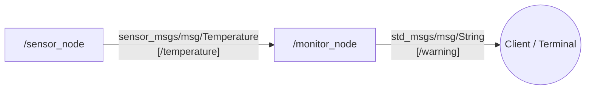

# Sensor Monitor Package


## Structure
The package consists of two nodes:
- `/sensor_node` (`sensor_node.cpp`): Publishes simulated temperature data between `18.0` and `35.0` °C on the `/temperature` topic.
- `/monitor_node` (`monitor_node.cpp`): Monitors the temperature, and if it exceeds 31 °C, it sends an alert on the `/warning` topic.

## Node and Topic Connections


## Build and Run


```bash
cd ~/ros2_ws
source /opt/ros/jazzy/setup.bash
colcon build --packages-select bok_xwx_1sensor1monitor
```

```bash
source install/setup.bash
ros2 launch bok_xwx_1sensor1monitor run_system.launch.py
```